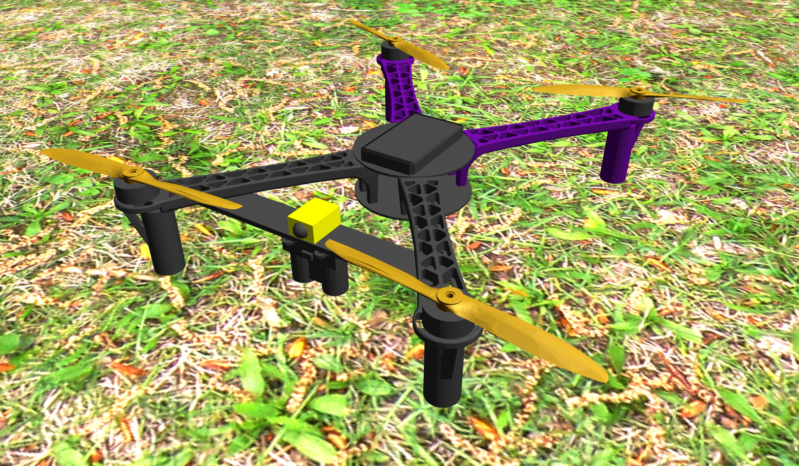

# Example custom drone
This package supplements a tutorial on how to create a custom drone model and how to use it with the MRS UAV System and Gazebo simulator.



The tutorial is available here:
https://ctu-mrs.github.io/docs/simulation/gazebo/gazebo/custom_drone.html

It covers the following steps:

- Custom directory setup
- Model template creation in Jinja
- Configuring a custom airframe for PX4
- Adding the custom drone to the MRS drone spawner
- Running the simulation with the MRS UAV System
- Adding a custom optional sensor (configurable by the MRS drone spawner)

## Running the full example
Clone this repo and build it in a catkin workspace. Use the start script `tmux/start.sh`.

## Configurables
The model can be equipped with additional components: laser rangefinder, custom monochrome camera, ground truth publisher.
These can be added in the spawner command:
```bash
rosservice call /mrs_drone_spawner/spawn "1 --$UAV_TYPE"
```
```bash
rosservice call /mrs_drone_spawner/spawn "1 --$UAV_TYPE --enable-ground-truth --enable-rangefinder --enable-custom-monochrome-camera"
```
The simulation is configured to start 3 state estimators:
- gps_baro
- gps_garmin
- passthrough

Baro estimator will work without any additional sensors. Garmin estimator requires the rangefinder for a more precise altitude estimation. Passthrough estimator uses the ground truth data and should provide the highest accuraccy of state estimation. These can be enabled or disabled in `tmux/config/custom_config.yaml`.
